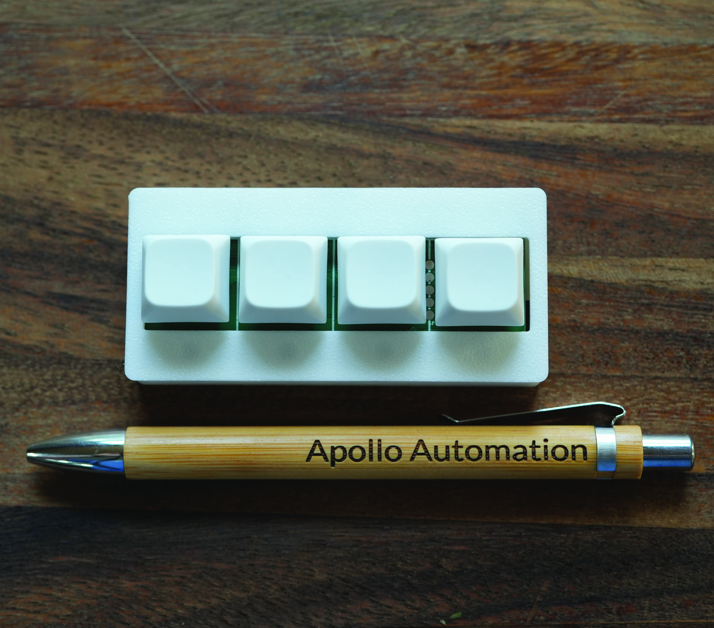

# Apollo BTN-1 Macro Deck

Key Features of the BTN-1 Macro Deck:

**Customizable Buttons:** 4 Cherry MX-compatible hot-swappable mechanical switches with dual LED feedback (under-key and front indicator LEDs). No soldering required for switch changes.

**Modular Design:** Supports large top attachments like e-ink displays for status updates and NFC readers/emitters for contactless interactions. Side attachments include additional buttons, rotary dials, OLED screens, LED matrices, and sensor mezzanines.

**Power & Connectivity:** USB-C or battery powered with Wi-Fi connectivity for wireless control and smart home integration.

**Versatile Applications:** Perfect for streamers, content creators, smart home enthusiasts, and IoT projects. Compatible with macro software and home automation platforms.

**Compact & Durable:** Small desktop footprint with sturdy enclosure designed for both desktop and mounted use in various environments.

Links:

Discord (Support/feedback/discussion/future products): [http://dsc.gg/ApolloAutomation](http://dsc.gg/ApolloAutomation)  
Shop: [https://apolloautomation.com/products/btn-1-macro-deck](https://apolloautomation.com/products/btn-1-macro-deck)  
Wiki: [https://wiki.apolloautomation.com](https://wiki.apolloautomation.com)